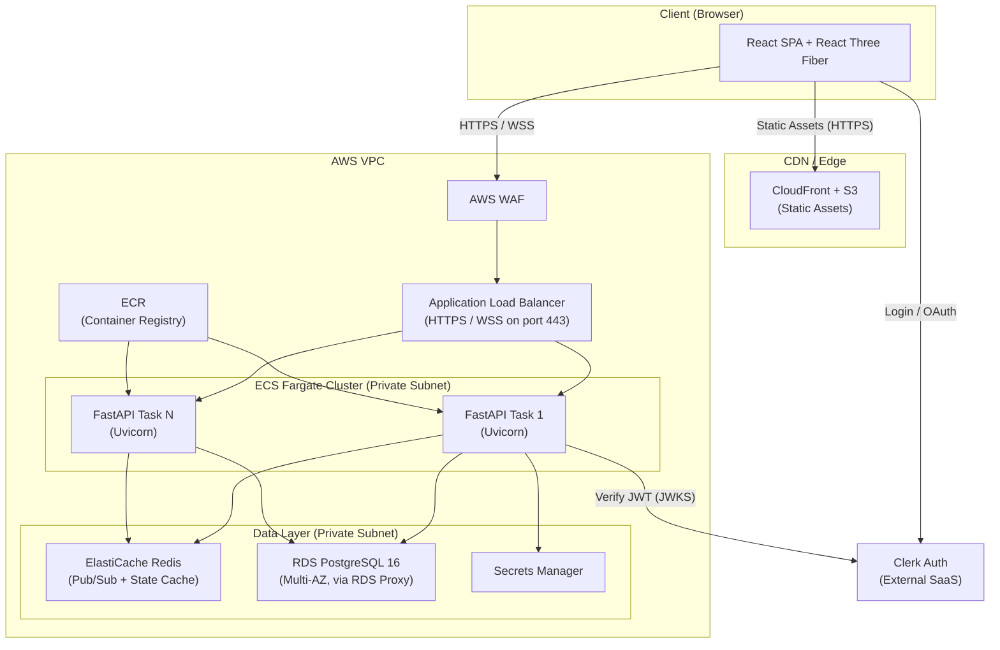
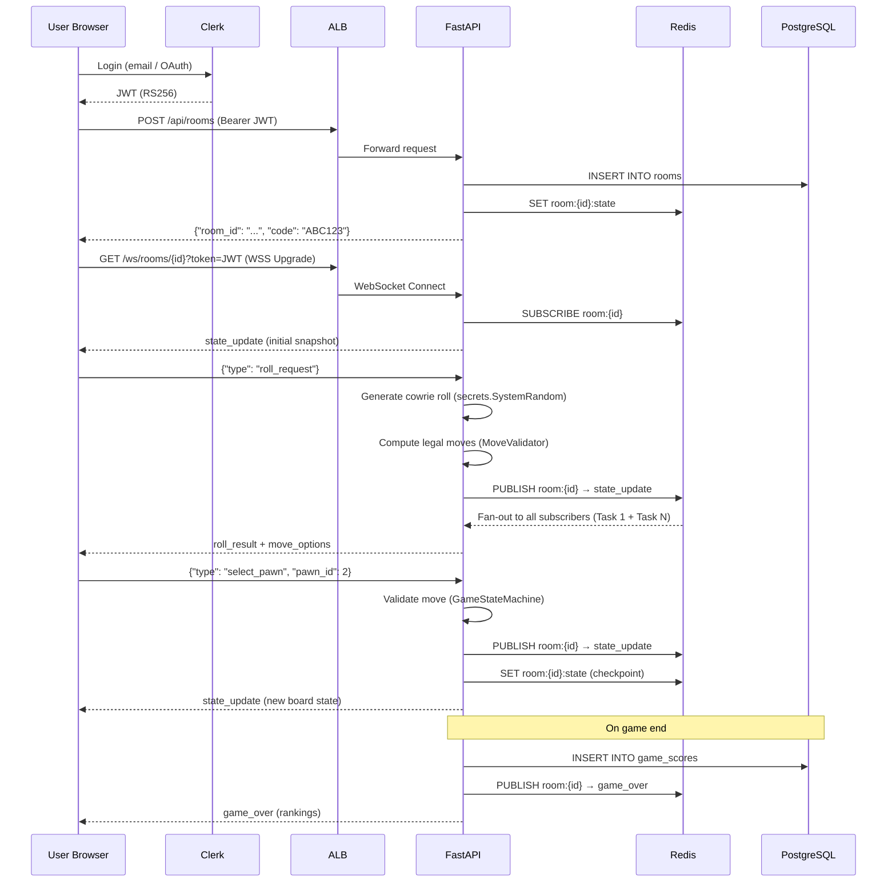
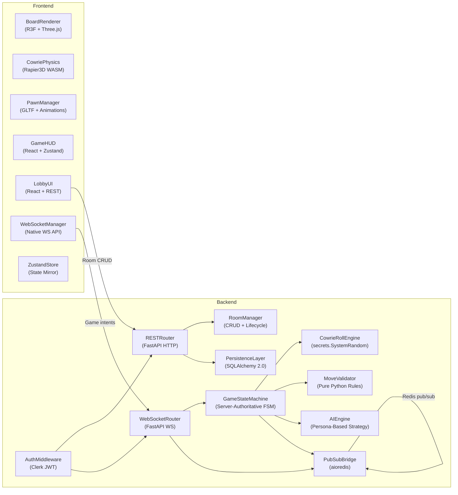
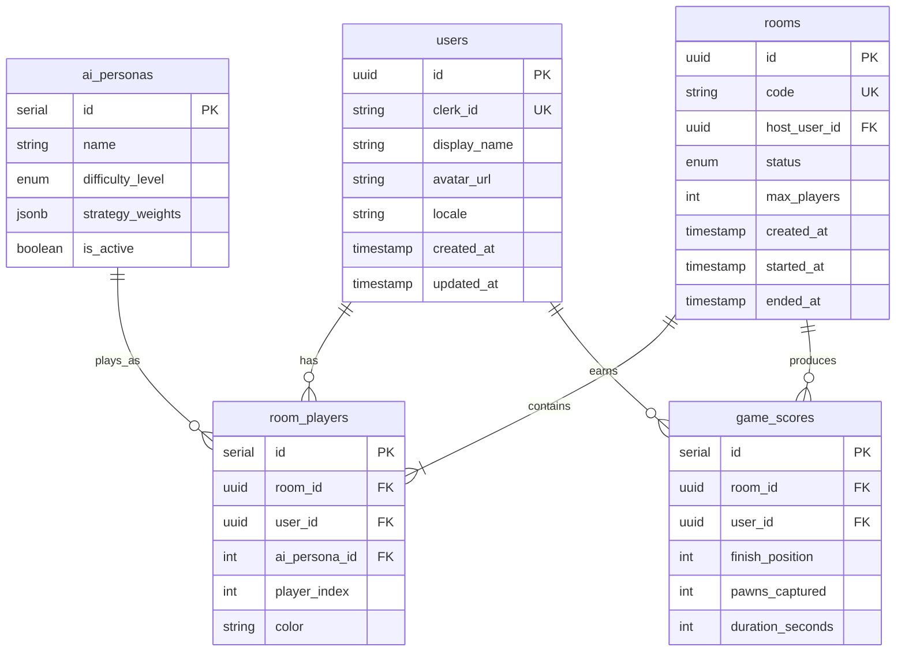
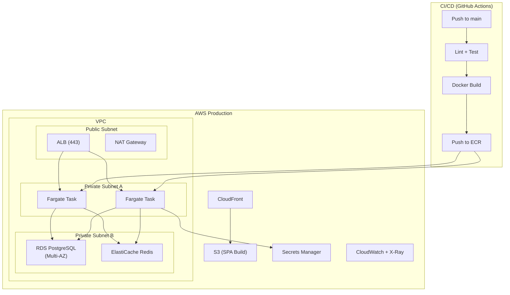

# Ashta Chamma 3D — System Architecture

This document describes the overall system architecture, data flows, and
component responsibilities for the Ashta Chamma 3D platform.

---

## System Architecture Overview

---

## WebSocket Real-Time Data Flow

---

## Component Responsibilities

---

## Database Schema (Entity Relationships)

---

## Infrastructure and Deployment

---

## Redis Data Structures

| Key Pattern | Type | Contents | TTL |
|---|---|---|---|
| `room:{id}:state` | Hash | Board positions, current turn, roll result, FSM phase | 24 h |
| `room:{id}:players` | Set | Connected player WebSocket IDs | 24 h |
| `room:{id}:chat` | List | Recent chat messages (capped at 100) | 24 h |
| `session:{clerk_id}` | Hash | Cached Clerk JWT claims | 15 min |

---

## API Endpoint Summary

| Method | Path | Auth | Purpose |
|---|---|---|---|
| `GET` | `/api/health` | None | Health check |
| `POST` | `/api/rooms` | Required | Create game room |
| `GET` | `/api/rooms/{code}` | Required | Get room info |
| `POST` | `/api/rooms/{code}/join` | Required | Join room |
| `DELETE` | `/api/rooms/{code}/leave` | Required | Leave room |
| `GET` | `/api/scores/leaderboard` | Optional | Leaderboard |
| `GET` | `/api/users/me` | Required | Current user profile |
| `PUT` | `/api/users/me` | Required | Update profile |
| `GET` | `/ws/rooms/{room_id}` | JWT query param | WebSocket game connection |

**OpenAPI (Swagger UI):** `/docs`  
**ReDoc:** `/redoc`

---

## Further Reading

- [ADR-001 — Modernization Strategy](./adr/001-modernization-strategy.md)
- [ADR-002 — Authentication Provider (Clerk)](./adr/002-authentication-provider.md)
- [ADR-003 — Game State Architecture (Server-Authoritative FSM)](./adr/003-game-state-architecture.md)
- [ADR-004 — Real-Time Communication (WebSocket + Redis Pub/Sub)](./adr/004-realtime-communication.md)
- [Runbook — ECS Deployment Rollback](./runbooks/ecs-rollback.md)
- [Runbook — RDS Failover Procedure](./runbooks/rds-failover.md)
- [Runbook — Redis Connection Failure Recovery](./runbooks/redis-recovery.md)
- [Runbook — Debugging WebSocket Disconnections](./runbooks/websocket-debugging.md)
- [Runbook — Manual Room Cleanup](./runbooks/room-cleanup.md)
